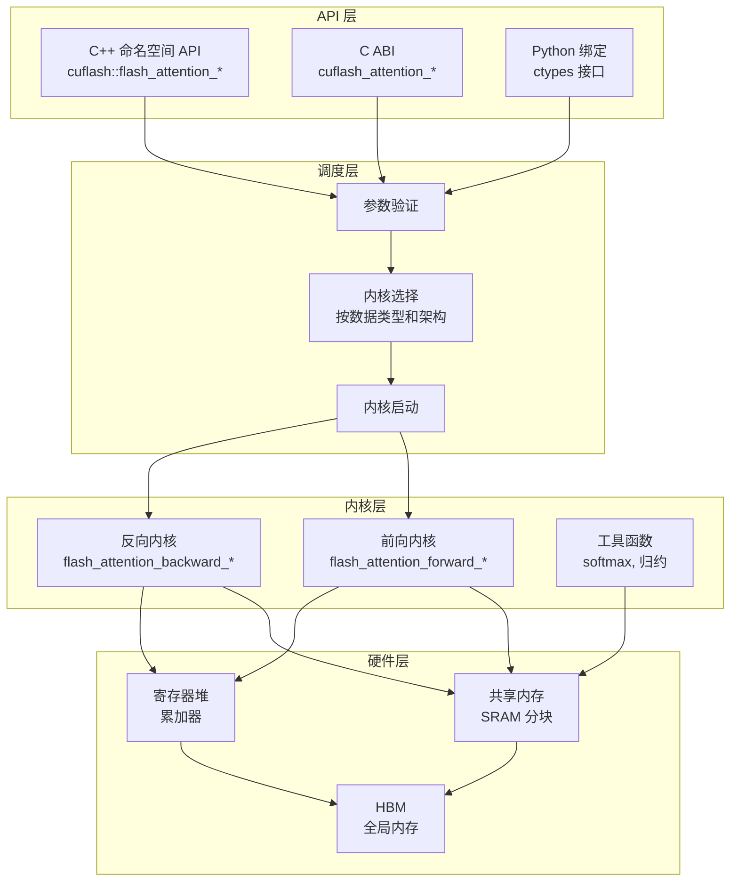
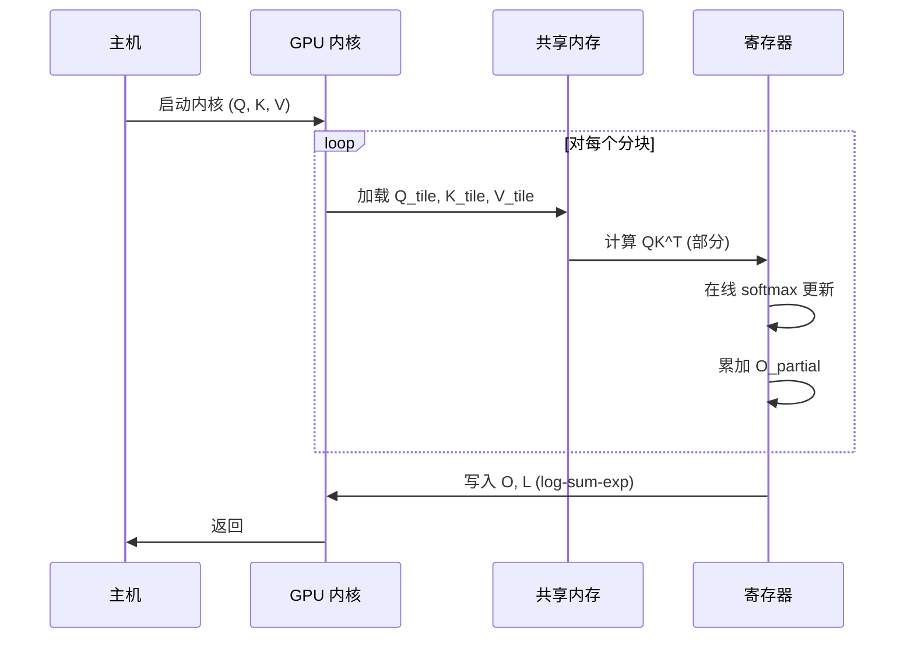
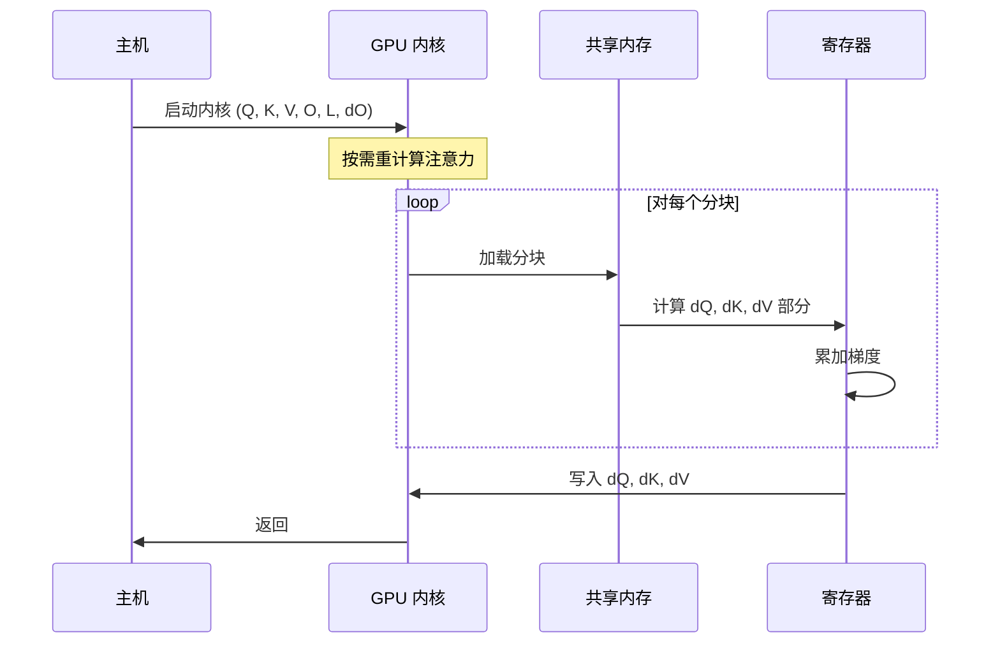
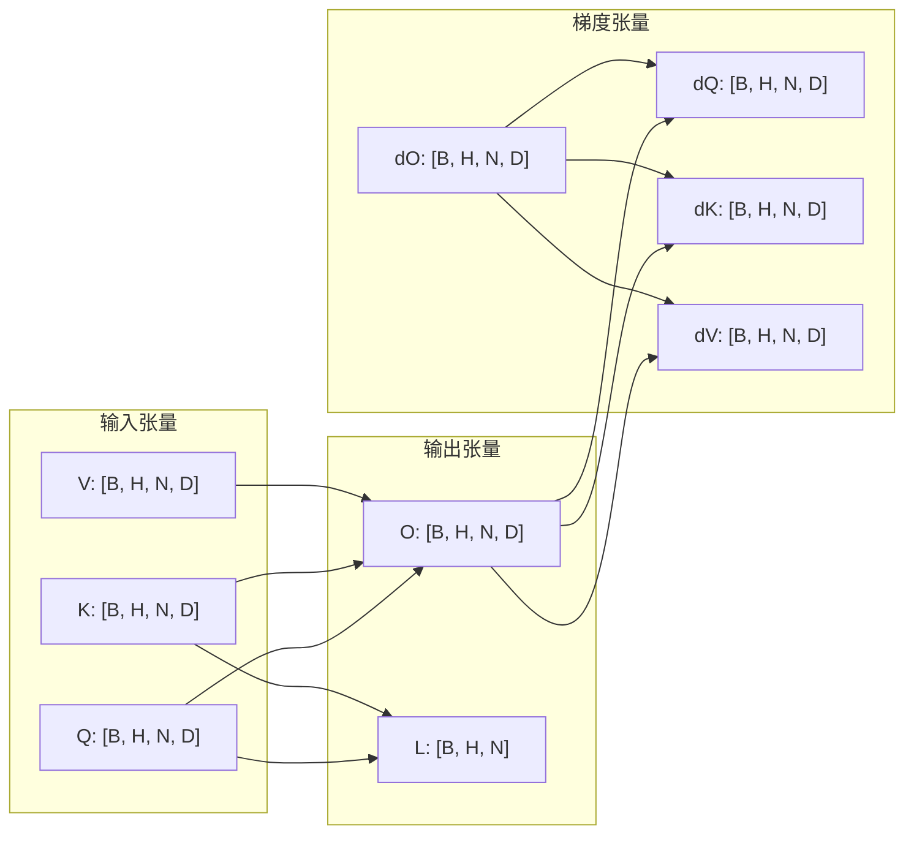
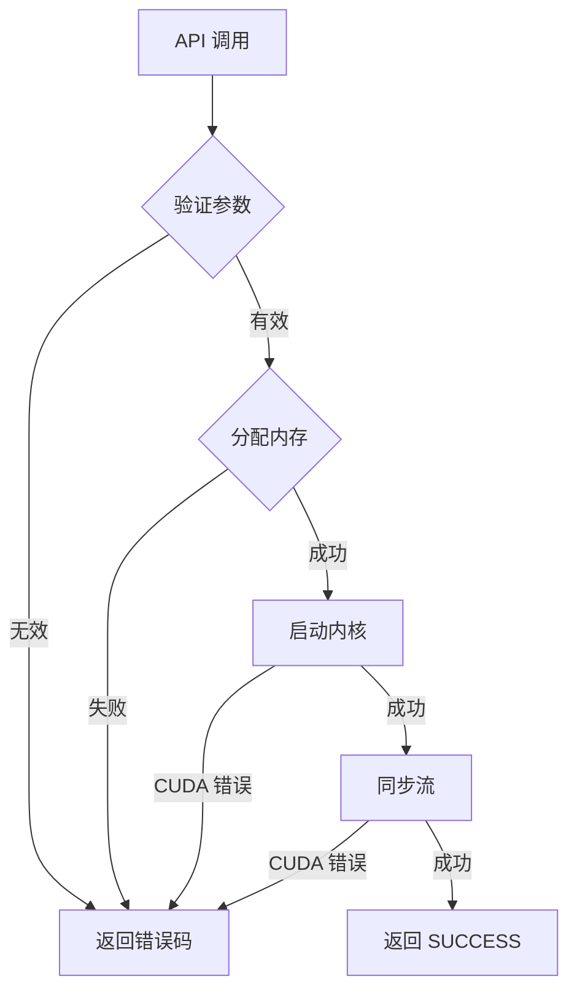

# 架构总览

本页提供 cuflash 的全面架构视图，面向需要理解系统设计的研究人员和工程师。

---

## 系统架构



---

## 数据流

### 前向传播



### 反向传播



---

## 内存布局



---

## 内核分块策略

### 分块维度

前向 tile 集中定义在 `src/kernels/impl/tile_io.cuh`（`ForwardTilingConfig`）：

| 参数 | 描述 | scalar 前向 | WMMA 前向 |
|------|------|-------------|-----------|
| `B_r` | Query 分块大小 | 64（hd128 为 32） | 64（hd128 为 32） |
| `B_c` | Key/Value 分块大小 | 64（hd128 为 32） | 32 |
| `D` | 头维度 | 32, 64, 128 | 32, 64, 128 |
| `T_r` | 每 Query 分块线程数 | 128 | 128 |

反向使用更保守的 `BackwardTilingConfig`（shared memory 要容纳更多梯度张量），例如
hd128 为 $16 \times 32$，hd64 为 $32 \times 32$。

### 内存复杂度

$$
\text{SRAM} = O(B_r \times D + B_c \times D + B_r \times B_c)
$$

例如 scalar 前向 ($B_r=64, B_c=64, D=64$，FP32)：

$$
\text{SRAM 元素} = 64 \times 64 \;(Q) + 64 \times 64 \;(K) + 64 \times 64 \;(V) + 64 \times 64 \;(S) + 64 \times 64 \;(O) + 64 + 64 = 20608
$$

即 $\approx 80$ KB（超过默认 48 KB 上限时由 launcher opt-in 动态共享内存），精确值见
`ForwardTilingConfig::smem_bytes`。

---

## 目录结构

```
cuflash/
├── include/cuflash/          # 公开 API 头文件
│   ├── flash_attention.h     # C++ 命名空间 API（含 C ABI 声明）
│   ├── export.h              # 可见性宏
│   └── version.h.in          # 版本头文件模板
├── src/
│   ├── api/                  # API 调度层
│   │   └── flash_attention_api.cu
│   ├── forward/              # 前向内核（统一模板）
│   │   ├── flash_attention_forward_typed.cu   # FP32/FP16/BF16 scalar 前向
│   │   └── flash_attention_forward_wmma.cu    # FP16/BF16 WMMA（Tensor Core）前向
│   ├── backward/             # 反向内核（统一模板，scalar）
│   │   └── flash_attention_backward_typed.cu
│   └── kernels/              # 共享工具
│       ├── impl/             # 内部实现细节（tiling 配置、online softmax、type adapter）
│       ├── matmul.cu / online_softmax.cu / tile_io.cu
│       └── kernel_launch_utils.cuh
└── tests/
    ├── unit/                  # 单元测试（gtest）
    ├── integration/           # API smoke + PyTorch 对比
    └── package_smoke/         # 安装包冒烟
```

---

## 错误处理流程



---

## 性能特征

| 操作 | 内存 | 计算 | 带宽受限 |
|------|------|------|----------|
| 前向 | $O(N)$ | $O(N^2)$ | 是 (低 D) |
| 反向 | $O(N)$ | $O(N^2)$ | 是 (低 D) |
| 重计算 | $O(1)$ | $O(N^2)$ | 是 |

::: tip 关键洞察
FlashAttention 通过永不物化完整注意力矩阵，将内存从 $O(N^2)$ 降至 $O(N)$。代价是在反向传播时重计算注意力分数，这是计算受限的操作，因此在现代 GPU 上效率很高。
:::
